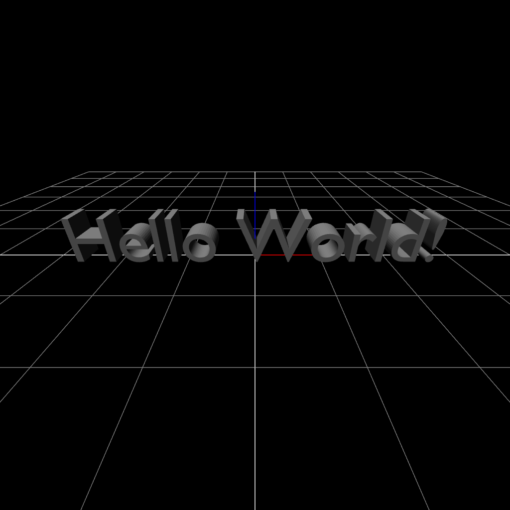

Here are a few examples you can get inspiration from:

# Simple and interactive Rotation Matrix Animation

```javascript
const { graph } = define('3d')

const identity = mat3()
const rotation = mat3_rot(vec3(0, 0, 1), Math.PI)

addSlider((t) => {
	const matrix = mat3_rlerp(identity, rotation, t)
	graph.transform(matrix)
})
```

# Basic 2D Particle Spring Physics Simulation

> Note: Drag to apply movement on the particle.

```javascript
const { graph, camera } = define('2d')

const m = 1            // mass
const s = vec2(0.5, 3) // position
const v = vec2(0)      // velocity

const anchor = vec2(0, 5)
const k = 10 // spring constant
const restLength = 2

const gravity = vec2(0, -9.81)

// the particle will be displayed as a small ball
const ball = {
	vertices: [vec2(0, 0)],
	indices: [],
	color: [0.5, 0.5, 1],
	matrix: mat2()
}

const triangleCount = 12, radius = 0.3

for (let i = 0; i < triangleCount; ++i) {
	const t = i / triangleCount * 2 * Math.PI
	ball.vertices.push(vec2(radius * Math.cos(t), radius * Math.sin(t)))
	ball.indices.push([0, i + 1, (i + 1) % triangleCount + 1])
}

graph.drawShape(ball)
graph.drawVector(add(anchor, vec2(0, 0.5)), anchor) // draws a vector to indicate the anchor position
graph.drawVector(anchor, s) // draws a line resembling the spring between mass and anchor

camera.reset()
camera.scale = 5

function calculateGravityForce() { // F = m * g
	return scale(m, gravity)
}

function calculateSpringForce() { // F = k * x (Hooke's Law)
	const force = k * (distance(s, anchor) - restLength)
	const direction = normalize(subtract(anchor, s))
	return scale(force, direction)
}

function calculateViewerForce() {
	const cameraPosition = vec2(camera.x, camera.y)
	const massToCameraVector = subtract(cameraPosition, s)

	if (length(massToCameraVector) > 0.001) { // user has moved the camera
		const force = 20
		const direction = normalize(massToCameraVector)
		return scale(force, direction)
	}

	return vec2(0)
}

function tick(t, dt) {
	dt = Math.min(dt, 0.1) // this is optional but prevents unrealistic behaviour when leaving the browser tab

	// accumulate forces
	const force = vec2(0)

	const gravityForce = calculateGravityForce()
	set(force, add(force, gravityForce))

	const springForce = calculateSpringForce()
	set(force, add(force, springForce))

	const viewerForce = calculateViewerForce()
	set(force, add(force, viewerForce))

	// update particle according to euler integration
	const a = scale(1 / m, force) // F = m * a => a = (1 / m) * F
	set(v, add(v, scale(dt, a)))  // v += a * dt
	set(v, scale(0.99, v))        // v *= 0.99 // apply drag 
	set(s, add(s, scale(dt, v)))  // s += v * dt

	// update camera and ball
	camera.x = s[0]
	camera.y = s[1]

	ball.matrix[0][2] = s[0]
	ball.matrix[1][2] = s[1]
	ball.update()
}

return tick
```

# Example Animation from `README.md`

> Note: Use the `lighting` render style.

```javascript
const { graph, camera } = define('3d')

camera.reset()
camera.yaw = 4 / 3 * Math.PI
camera.zoom = 10

const sphere = createSphere(vec3(0), 2)
graph.drawShape(sphere)

graph.drawLine([vec3(0, 0, -6), vec3(0)])
graph.drawLine([vec3(0, 0, 1), vec3(0, 0, 6)])

// start time, end time, animation matrix
const animations = [
	[0,    0.5,  (t) => mat3(0)],
	[0.5,  1.25, (t) => mat3(t, 0, 0)],
	[1.25, 2,    (t) => mat3(1, t, 0)],
	[2,    2.75, (t) => mat3(1, 1, t)],
	[2.75, 4.25, (t) => mat3_rot(vec3(1, 0, 0), t * 2 * Math.PI)],
	[4.25, 5.75, (t) => mat3_rot(vec3(0, 1, 0), t * 2 * Math.PI)],
	[5.75, 7.25, (t) => mat3_rot(vec3(0, 0, 1), t * 2 * Math.PI)],
	[7.25, 7.75, (t) => mat3(1 - t)]
]

function tick(t) {
  	t %= animations[animations.length - 1][1]
  
	for (let i = 0; i < animations.length; ++i) {
		const animation = animations[i]
		const t0 = animation[0]
		const t1 = animation[1]
    
		if (t >= t0 && t <= t1) {
			const f = animation[2]
			const x = smoothstep(0, 1, clampf(t, t0, t1))
			graph.transform(f(x))
			
			return
		}
	}
}

return tick
```


# Normal Comparison Animation from `graph-types.md`

> Note: Use the `lighting` render style.

```javascript
const { graph, camera } = define('3d')

graph.drawAxis(false)
graph.drawGrid(false)

const cube1 = createCube(vec3(1, -3, 0), 2, 2, 2)
const cube2 = createCube(vec3(-3, -3, 0), 2, 2, 2)
const sphere1 = createSphere(vec3(2, 2, 1), 1)
const sphere2 = createSphere(vec3(-2, 2, 1), 1)

graph.drawShape(cube1, 0)
graph.drawShape(cube2, 1)
graph.drawShape(sphere1, 0)
graph.drawShape(sphere2, 1)

camera.reset()
camera.pitch = Math.PI / 4
camera.zoom = 7

function tick(t) {
	camera.yaw = 9 / 8 * Math.PI + t * Math.PI / 4
}

return tick
```


# Example Geometry created in Blender

> Note: This code works with any `.obj` file but may affect performance with larger files.

```javascript
const { graph, camera } = define('3d')

const source = `` // paste your .obj file data here

const shape = fromOBJ(source)

// adjust rotation as Blender saves vertices with "upwards" being in the positive Y direction
shape.matrix = mat3_rot(vec3(1, 0, 0), Math.PI / 2)

graph.drawShape(shape, 1)

// adjust camera to face the model's front
camera.reset()
camera.yaw = 0
camera.zoom = 4

// adjust light to face the models's front
graph.setLightDirection(vec3(1, 2, -4))
```

## `Hello World!` Text Example

> Note: For own blender projects you can follow these instructions at `Export your file...`.

Open Blender, create a default file and delete the default cube. Create a text element under `Add` > `Text`. Press `Tab` to switch to `Edit Mode`. Write your text, in this case `Hello World!`. Select your text object in the `Outliner` panel, select the `Object` tab and set `Rotation X` to `90°`. Then open the `Data` tab in the `Properties` panel. Adjust `Shape` > `Resolution Preview U` if you want a lower triangle count. Set `Geometry` > `Extrude` to `0.2m` for a 3D effect and `Paragraph` > `Alignment` > `Horizontal` to `Center`. Export your file under `File` > `Export` > `Wavefront (.obj)` and select the folder the file should be saved to. A `.obj` and `.mtl` file will be created. Open the `.obj` file with a text edtior and copy the data (`Ctrl` + `A`, `Ctrl` + `C`). Finally, paste it into the `source` variable in your code (`Ctrl` + `V`).

> Note: Use the `lighting` render style.

