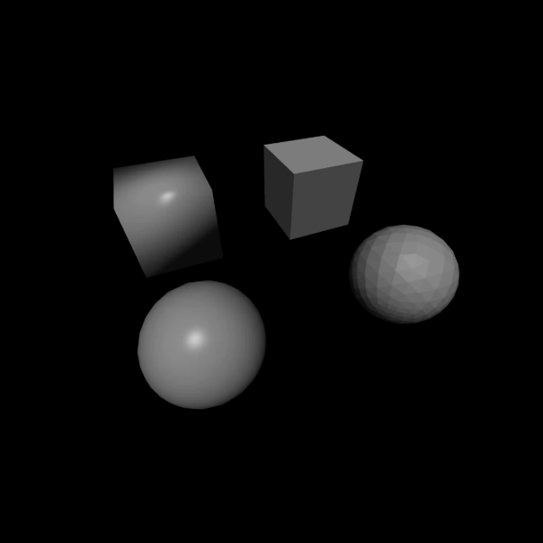

A graph type can be declared using the `define` function. The following graph types are available.

> Note: Many graph functions only perform type checks when called but modification of values is not detected. Ensure that after modifying any values they are valid as values are directly send to the GPU and not constantly type checked for efficiency reasons. Otherwise, unexpected behaviour might occur. For good practice use `set` and `copy` for modifying vectors and matrices.

# 2D

JavaScript declaration:

```javascript
const { graph, camera } = define('2d')
```

## Graph functions

| Function | Parameters | Description |
| - | - | - |
| `drawGrid(flag: boolean)` | `flag` | Sets whether the default grid should be rendered. |
| `drawAxis(flag: boolean)` | `flag` | Sets whether the coordinate axis should be rendered. |
| `transform(m: mat2)`      | `m`    | Visually applies a matrix to all elements on the graph. Modifying `m` afterwards will have no effect. Calling `transform` a second time is necessary. Grids are deactivated for matrices that might cause excessive rendering. |
| `drawLine(line: vec2[])`  | `line` | Draws a connected line from each point to the next. |
| `drawVector(v1: vec2, v2?: vec2)` | `v1`: start point of the vector.<br>`v2`: endpoint of the vector.<br>If `v2` is not provided, the vector is assumed to reach from the origin to `v1`. | Draws a vector in the shape of an arrow. |
| `drawShape(shape)` | `shape`: an object containing the following properties:<br><ul><li>`vertices`: a `vec2[]` containing the polygon's points.</li><li>`indices`: an array containing triangles in the form of arrays with three indices that each reference a point in `vertices`.</li><li>`color` _(optional)_: an array of length 3 storing RGB color values in the range from 0 to 1.</li><li>`matrix` _(optional)_: a `mat2` that is applied to each vertex before rendering. An additional column vector for translation can be added by converting the matrix to a 2x3 matrix.</li></ul> | Draws a polygon.<br><br>Upon calling `drawShape` two functions are attached to the `shape` object:<br><ul><li>`update(flag: boolean = false)`: Updates a shape's `color` and `matrix`. Given `flag` is `true`, the `vertices` and `indices` are also updated. Calling `update` with `flag` as `true` very often is discouraged as it can be computationally expensive with shapes that contain large numbers of triangles. Setting `flag` to `true` should only be done with appropriate time intervals between calls.</li><li>`remove()`: removes the shape from the graph and deletes its attached `update` and `remove` functions.</li></ul> |

## Camera Properties

| Property | Range | Description |
| - | - | - |
| `x`     | $\mathbb R$                 | Camera X-coordinate |
| `y`     | $\mathbb R$                 | Camera Y-coordinate |
| `scale` | $\left[10^{-8}, 64 \right]$ | Visual graph size |

## Render Styles

`2d` only supports `geometry`.

# 3D

JavaScript declaration:

```javascript
const { graph, camera } = define('3d')
```

## Graph Functions

| Function | Parameters | Description |
| - | - | - |
| `drawGrid(flag: boolean)` | `flag` | Sets whether the default grid should be rendered. |
| `drawAxis(flag: boolean)` | `flag` | Sets whether the coordinate axis should be rendered. |
| `transform(m: mat3)`      | `m`    | Visually applies a matrix to all elements on the graph. Modifying `m` afterwards will have no effect. Calling `transform` a second time is necessary. |
| `drawLine(line: vec3[])`  | `line` | Draws a connected line from each point to the next. |
| `drawVector(v1: vec3, v2?: vec3)` | `v1`: start point of the vector.<br>`v2`: endpoint of the vector.<br>If `v2` is not provided, the vector is assumed to reach from the origin to `v1`. | Draws a vector in the shape of an arrow. |
| `drawShape(shape, mode: 0 \| 1 = 0)` | `shape`: an object containing the following properties:<br><ul><li>`vertices`: a `vec3[]` containing the polyhedron's points.</li><li>`indices`: an array containing triangles in the form of arrays with three indices that each reference a point in `vertices`.</li><li>`color` _(optional)_: an array of length 3 storing RGB color values in the range from 0 to 1.</li><li>`matrix` _(optional)_: a `mat3` that is applied to each vertex before rendering. An additional column vector for translation can be added by converting the matrix to a 3x4 matrix.</li></ul><br>`mode`: Whether to calculate weighted normals (`0`) or face normals (`1`). By default, weighted normals are used. For more info about this topic, see the section on normal calculation below. | Draws a polyhedron.<br><br>Upon calling `drawShape` two functions are attached to the `shape` object:<br><ul><li>`update(flag: boolean = false)`: Updates a shape's `color` and `matrix`. Given `flag` is `true`, the `vertices` and `indices` are also updated. Calling `update` with `flag` as `true` very often is discouraged as it can be computationally expensive with shapes that contain large numbers of triangles. Setting `flag` to `true` should only be done with appropriate time intervals between calls.</li><li>`remove()`: removes the shape from the graph and deletes its attached `update` and `remove` functions.</li></ul> |
| `setLightDirection(direction: vec3)` | `direction` | Sets the light direction used for rendering in the `lighting` render style. Modifying `direction` afterwards will have no effect. Calling `setLightDirection` a second time is necessary. |

## Camera Properties

| Property | Range | Description |
| - | - | - |
| `x`     | $\mathbb R$              | Camera X-coordinate |
| `y`     | $\mathbb R$              | Camera Y-coordinate |
| `z`     | $\mathbb R$              | Camera Z-coordinate |
| `roll`  | $\mathbb R$              | Camera roll in radians |
| `pitch` | $\mathbb R$              | Camera pitch in radians |
| `yaw`   | $\mathbb R$              | Camera yaw in radians |
| `zoom`  | $\left[0, \infty\right)$ | Offset to (`x`, `y`, `z`) in opposite direction of view direction |
| `fov`   | $\left(0, \pi\right)$    | Field of view in radians |

## Render Styles

| Render Style | Description |
| - | - |
| `geometry` | Shapes are rendered with flat colors and wireframes. |
| `lighting` | Shapes are shaded according to the Phong reflection model. |

## Builtin Shape Generation

The following predefined functions automatically generate an object containing vertices and indices for quads, cubes, spheres and OBJ models.

| Function | Paramters |
| - | - |
| `createQuad(v0: vec3, v1: vec3, v2: vec3, v3: vec3)` | `v0`, `v1`, `v2`, `v3`: vertices of the quad in counterclockwise order. |
| `createCube(position: vec3, width: number, depth: number, height: number)` | `position`: the cube's origin corner.<br>`width`: the cube's width (in positive X direction).<br>`depth`: the cube's depth (in positive Y direction).<br>`height`: the cube's height (in positive Z direction). |
| `createSphere(position: vec3, radius: number, resolution: number = 3)` | `position`: the sphere's center.<br>`radius`: the sphere's radius.<br>`resolution`: the sphere's resolution.<br><br>Spheres are generated by subdividing an octahedron's triangles and then scaling each vertex length to the radius. This approach generates $4 \cdot 6^{\left\lfloor resolution \right\rfloor}$ vertices and can be computationally expensive. Anything of a resolution greater than 4 is discouraged and should be compensated for by setting the `mode` parameter in `drawShape` to `0` to create an artificial smoothness effect. |
| `fromOBJ(source: string)` _(experimental)_ | `source`: a `.obj` file's text data from which vertex and triangle data will be extracted.<br><br>Models with large triangle count can impact performance. Some shapes may also appear rotated but setting the shape's `matrix` property to a rotation matrix such as `mat3_rot(vec3(1, 0, 0), Math.PI / 2)` usually helps. |

## Normal Calculation

The 3D Graph offers two methods to render shaded surfaces in the `lighting` render style depending on the normals that are used for lighting calculations. 

| Weighted Normals (`0`) | Face Normals (`1`) |
| - | - |
| Weighted Normals calculate normals per vertex and are in favour of triangles with larger areas. These can be beneficial for shapes with smooth surfaces but create ugly lighting effects on shapes with sharp edges such as cubes (See the cube in the scene below behind the smooth sphere). | Face Normals calculate normals per triangle face and are therefore more computationally expensive. However, these create better effects for sharp edges and are better for shapes with larger flat faces. |

