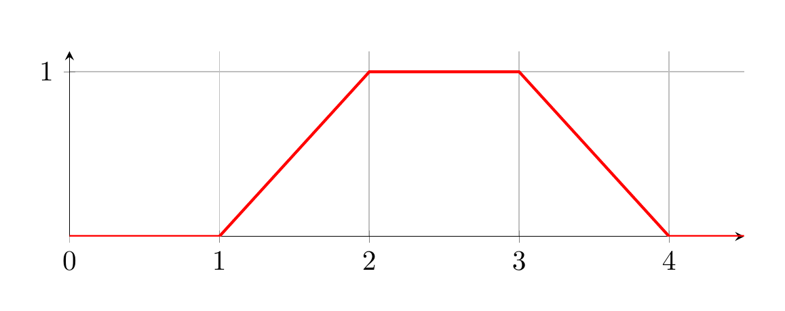

MathBox features a set of predefined functions for an easier use with mathematical computations.

> Note: Many functions are not type checked. Make sure your arguments are correct, otherwise unexpected behaviour might occur.

# Vectors

Vectors follow the structure of an array of numbers. The array's length represents the vector's dimension and must be at least 1.

In TypeScript notation:

`type vector = number[]`

Throughout the wiki you will also find the types for 2D, 3D and 4D vectors referenced as `vec2`, `vec3` and `vec4`.

## Vector Constructors

The following constructors for vectors of dimensions 2, 3 and 4 are predefined.

$x, y, z, w, n \in \mathbb R$

<table>
<tr>
<th>2D Vector Constructors</th>
<th>Result</th>
</tr>
<tr>
<td>

`vec2()`

</td>
<td>

```math
\begin{bmatrix} 0 \\ 0 \end{bmatrix}
```

</td>
</tr>
<tr>
<td>

`vec2(n)`

</td>
<td>

```math
\begin{bmatrix} n \\ n \end{bmatrix}
```

</td>
</tr>
<tr>
<td>

`vec2(x, y)`

</td>
<td>

```math
\begin{bmatrix} x \\ y \end{bmatrix}
```

</td>
</tr>
</table>

<table>
<tr>
<th>3D Vector Constructors</th>
<th>Result</th>
</tr>
<tr>
<td>

`vec3()`

</td>
<td>

```math
\begin{bmatrix} 0 \\ 0 \\ 0 \end{bmatrix}
```

</td>
</tr>
<tr>
<td>

`vec3(n)`

</td>
<td>

```math
\begin{bmatrix} n \\ n \\ n \end{bmatrix}
```

</td>
</tr>
<tr>
<td>

`vec3(x, y, z)`

</td>
<td>

```math
\begin{bmatrix} x \\ y \\ z \end{bmatrix}
```

</td>
</tr>
</table>

<table>
<tr>
<th>4D Vector Constructors</th>
<th>Result</th>
</tr>
<tr>
<td>

`vec4()`

</td>
<td>

```math
\begin{bmatrix} 0 \\ 0 \\ 0 \\ 0 \end{bmatrix}
```

</td>
</tr>
<tr>
<td>

`vec4(n)`

</td>
<td>

```math
\begin{bmatrix} n \\ n \\ n \\ n \end{bmatrix}
```

</td>
</tr>
<tr>
<td>

`vec4(x, y, z, w)`

</td>
<td>

```math
\begin{bmatrix} x \\ y \\ z \\ w \end{bmatrix}
```

</td>
</tr>
</table>

## Vector Functions

The following operations and functions for vectors are predefined.

> Note: Vector arguments must always be of the same dimension.

| Name | Math | JavaScript | Notes |
| - | - | - | - |
| Copy | | `copy(a)`   | Returns a new copy of `a` that does not reference the original object. |
| Set  | | `set(a, b)` | Copies the values of `b` to `a` as JavaScript's `a = b` syntax does not modify other references to `a`. |
| Addition               | $\vec{a} + \vec{b}$                                      | `add(a, b)`      | |
| Subtraction            | $\vec{a} - \vec{b}$                                      | `subtract(a, b)` | |
| Scalar Multiplication  | $s \cdot \vec{a}$                                        | `scale(s, a)`    | |
| Dot Product            | $\vec{a} \cdot \vec{b}$                                  | `dot(a, b)`      | Returns scalar value. |
| Cross Product          | $\vec{a} \times \vec{b}$                                 | `cross(a, b)`    | Arguments must be of type `vec3`. |
| Length                 | $\left\lvert\vec{a}\right\rvert$                         | `length(a)`      | Returns scalar value. |
| Distance of two points | $\left\lvert\vec{b}-\vec{a}\right\rvert$                 | `distance(a, b)` | Returns scalar value. |
| Normalizing            | ${1 \over \left\lvert\vec{a}\right\rvert} \cdot \vec{a}$ | `normalize(a)`   | |

# Matrices

Matrices follow the structure of 2d number arrays. Matrices are in row-major order, meaning subarrays represent individual rows. The array's length represents the matrix row number and the length of subarrays the matrix column number. If the length varies between subarrays, the value is not interpreted as a matrix.

In TypeScript notation:

`type matrix = number[][] // subarrays must be of same length!`

Throughout the wiki you will also find the types for 2x2, 3x3 and 4x4 matrices referenced as `mat2`, `mat3` and `mat4`.

## Matrix Constructors

The following constructors for 2x2, 3x3 and 4x4 matrices are predefined.

$n, m_{ij} \in \mathbb R$

$\vec{i}, \vec{j}, \vec{k}, \vec{l} \in \mathbb R^D$ (Vectors of same dimension as matrix, e.g., `vec2` for `mat2`)

<table>
<tr>
<th>2x2 Matrix Constructors</th>
<th>Result</th>
</tr>
<tr>
<td>

`mat2()`

</td>
<td>

```math
\begin{bmatrix} 1 && 0 \\ 0 && 1 \end{bmatrix}
```

</td>
</tr>
<tr>
<td>

`mat2(n)`

</td>
<td>

```math
\begin{bmatrix} n && 0 \\ 0 && n \end{bmatrix}
```

</td>
</tr>
<tr>
<td>

`mat2(m00, m11)`

</td>
<td>

```math
\begin{bmatrix} m_{00} && 0 \\ 0 && m_{11} \end{bmatrix}
```

</td>
</tr>
<tr>
<td>

`mat2(m00, m01, m10, m11)`

</td>
<td>

```math
\begin{bmatrix} m_{00} && m_{01} \\ m_{10} && m_{11} \end{bmatrix}
```

</td>
</tr>
<tr>
<td>

`mat2(i, j)`

</td>
<td>

```math
\begin{bmatrix} \vec{i}_x && \vec{j}_x \\ \vec{i}_y && \vec{j}_y \end{bmatrix}
```

</td>
</tr>
</table>

<table>
<tr>
<th>3x3 Matrix Constructors</th>
<th>Result</th>
</tr>
<tr>
<td>

`mat3()`

</td>
<td>

```math
\begin{bmatrix} 1 && 0 && 0 \\ 0 && 1 && 0 \\ 0 && 0 && 1 \end{bmatrix}
```

</td>
</tr>
<tr>
<td>

`mat3(n)`

</td>
<td>

```math
\begin{bmatrix} n && 0 && 0 \\ 0 && n && 0 \\ 0 && 0 && n \end{bmatrix}
```

</td>
</tr>
<tr>
<td>

`mat3(m00, m11, m22)`

</td>
<td>

```math
\begin{bmatrix} m_{00} && 0 && 0 \\ 0 && m_{11} && 0 \\ 0 && 0 && m_{22} \end{bmatrix}
```

</td>
</tr>
<tr>
<td>

`mat3(m00, m01, m02, m10, m11, m12, m20, m21, m22)`

</td>
<td>

```math
\begin{bmatrix} m_{00} && m_{01} && m_{02} \\ m_{10} && m_{11} && m_{12} \\ m_{20} && m_{21} && m_{22} \end{bmatrix}
```

</td>
</tr>
<tr>
<td>

`mat3(i, j, k)`

</td>
<td>

```math
\begin{bmatrix} \vec{i}_x && \vec{j}_x && \vec{k}_x \\ \vec{i}_y && \vec{j}_y && \vec{k}_y \\ \vec{i}_z && \vec{j}_z && \vec{k}_z \end{bmatrix}
```

</td>
</tr>
</table>

<table>
<tr>
<th>4x4 Matrix Constructors</th>
<th>Result</th>
</tr>
<tr>
<td>

`mat4()`

</td>
<td>

```math
\begin{bmatrix} 1 && 0 && 0 && 0 \\ 0 && 1 && 0 && 0 \\ 0 && 0 && 1 && 0 \\ 0 && 0 && 0 && 1 \end{bmatrix}
```

</td>
</tr>
<tr>
<td>

`mat4(n)`

</td>
<td>

```math
\begin{bmatrix} n && 0 && 0 && 0 \\ 0 && n && 0 && 0 \\ 0 && 0 && n && 0 \\ 0 && 0 && 0 && n \end{bmatrix}
```

</td>
</tr>
<tr>
<td>

`mat4(m00, m11, m22, m33)`

</td>
<td>

```math
\begin{bmatrix} m_{00} && 0 && 0 && 0 \\ 0 && m_{11} && 0 && 0 \\ 0 && 0 && m_{22} && 0 \\ 0 && 0 && 0 && m_{33} \end{bmatrix}
```

</td>
</tr>
<tr>
<td>

`mat4(m00, m01, m02, m03, m10, m11, m12, m13, m20, m21, m22, m23, m30, m31, m32, m33)`

</td>
<td>

```math
\begin{bmatrix} m_{00} && m_{01} && m_{02} && m_{03} \\ m_{10} && m_{11} && m_{12} && m_{13} \\ m_{20} && m_{21} && m_{22} && m_{23} \\ m_{30} && m_{31} && m_{32} && m_{33} \end{bmatrix}
```

</td>
</tr>
<tr>
<td>

`mat4(i, j, k, l)`

</td>
<td>

```math
\begin{bmatrix} \vec{i}_x && \vec{j}_x && \vec{k}_x && \vec{l}_x \\ \vec{i}_y && \vec{j}_y && \vec{k}_y && \vec{l}_y \\ \vec{i}_z && \vec{j}_z && \vec{k}_z && \vec{l}_z \\ \vec{i}_w && \vec{j}_w && \vec{k}_w && \vec{l}_w \end{bmatrix}
```

</td>
</tr>
</table>

## Matrix Functions

The following operations and functions for matrices are predefined.

> Note: Matrix arguments must always be of same dimensions.

| Name | Math | JavaScript | Notes |
| - | - | - | - |
| Copy | | `copy(A)`   | Returns a new copy of `A` that does not reference the original object. |
| Set  | | `set(A, B)` | Copies the values of `B` to `A` as JavaScript's `A = B` syntax does not modify other references to `A`. |
| Addition               | $A+B$       | `add(A, B)`      | |
| Subtraction            | $A-B$       | `subtract(A, B)` | |
| Scalar Multiplication  | $s \cdot A$ | `scale(s, A)`    | |
| Matrix Multiplication  | $A \cdot B$ | `mul(A, B)`      | Both arguments are assumed to be matrices for which the number of columns of `A` matches the number of rows of `B`. If you expect the result to be a vector you will need to be aware that the result will be of type `number[][]`. Either use `apply` or map the result's subarrays to each subarray's first value. |
| Matrix-Vector Multiplication  | $A \cdot \vec{v}$ | `apply(A, v)`      | Multiplies a matrix of type `number[][]` with a vector of type `number[]` and returns the resulting vector as type `number[]`. |
| Transpose       | $A^T$                       | `transpose(A)`       | |
| Submatrix       |                             | `submatrix(A, i, j)` | `i`, `j` are the indices of the row and column that should be excluded and start at 0. |
| Minor           | $M_{ij}$                    | `minor(A, i, j)`     | `A` must be a square matrix. `i`, `j` are the minor element indices in `a` and start at 0. |
| Cofactor        |                             | `cofactor(A, i, j)`  | `A` must be a square matrix. `i`, `j` are the cofactor element indices in `a` and start at 0. |
| Determinant     | $\left\lvert A\right\rvert$ | `det(A)`             | `A` must be a square matrix.  |
| Cofactor Matrix | cof(A)                      | `cof(A)`             | `A` must be a square matrix. |
| Adjugate        | adj(A)                      | `adj(A)`             | `A` must be a square matrix. |
| Inverse         | $A^{-1}$                    | `inv(A)`             | `A` must be an invertible square matrix, otherwise undefined is returned. |

# Integrated Helper Functions

## LaTeX

If you want to quickly format a vector or matrix to LaTeX notation, you can use the `latex` function.

| Function | Parameters |
| - | - |
| `latex(v, delimiters: string): string` | `v`: The vector or matrix you wish to format.<br>`delimiters`: The LaTeX math delimiters in which the expression will be wrapped. The default is `'$'` but you can change it to `'$$'` for display math. |

## Rotation Matrices

The following functions create rotation matrices for 2D and 3D.

| Function | Parameters |
| - | - |
| `mat2_rot(t: number): mat2` | `t`: rotation angle in radians |
| `mat3_rot(v: vec3, t: number): mat3` | `v`: a non-zero vector acting as the rotation axis.<br>`t`: rotation angle in radians |

## Interpolation

If you've worked on animations before, interpolation will sound familiar to you. To assist, MathBox supports both `lerp` and `smoothstep` for linear and smooth interpolation. These work with numbers, vectors and matrices.

| Function | Parameters |
| - | - |
| `lerp(s, e, t: number)`, `smoothstep(s, e, t: number)` | `s`: start value<br>`e`: end value<br>`t`: interpolation factor |

Additionally, there are special interpolation functions for `mat2` and `mat3` that display change by visually rotating the individual matrix column vectors.

| Function | Parameters |
| - | - |
| `mat2_rlerp(s: mat2, e: mat2, t: number): mat2` | `s`: start matrix<br>`e`: end matrix<br>`t`: interpolation factor |
| `mat3_rlerp(s: mat3, e: mat3, t: number): mat3` | `s`: start matrix<br>`e`: end matrix<br>`t`: interpolation factor |

## Clamping Functions

| Function | Description |
| - | - |
| `clamp(x: number, min: number, max: number): number` | Returns `x` constrained between the two bounds of the range [`min`, `max`]. |
| `clampf(y: number, min: number, max: number): number` | Returns `y` normalized from the bounds of the provided range [`min`, `max`] to [`0`, `1`]. This is helpful for animations with sine curves that might need to be transformed from the range [`-1`, `1`] to [`0`, `1`]. |

## Miscellaneous

| Property Name | Description |
| - | - |
| `bounce(t: number): number` | A function equal to `clamp(1.5 - abs(mod(t, 4) - 2.5), 0, 1)` that might be helpful with animation loops. The function repeats every 4 units. |
| `cartesian2gl` | A `mat3` that transforms the graph back into the OpenGL coordinate system (swaps positve Y with negative Z axis). |